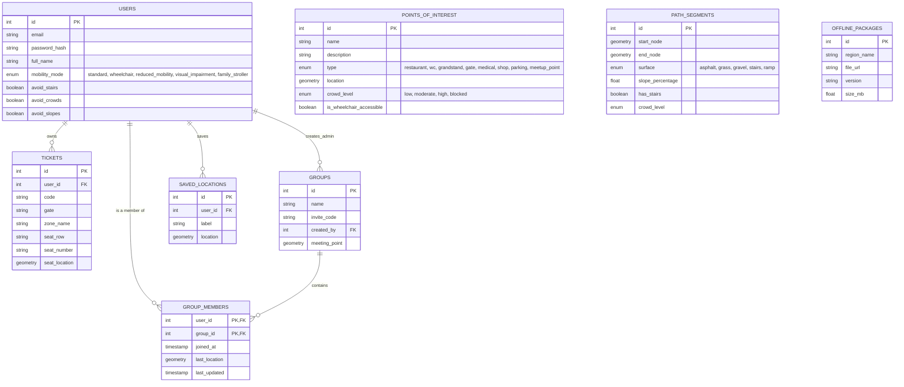

# Database Schema: Circuit Copilot
> **Project:** Accessibility + Real-Time
> **Context:** Route management, accessibility, and groups for circuit events.

## 1. Visual Diagram (ERD)

This diagram represents the main entities and relationships.

