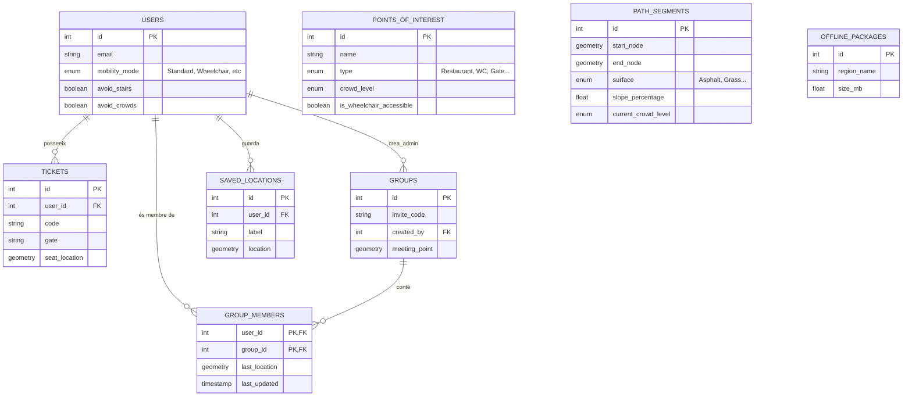

# Esquema de Base de Dades: Circuit Copilot
> **Projecte:** Accessibilitat + Temps Real
> **Context:** Gestió de rutes, accessibilitat i grups per a esdeveniments al circuit.

## 1. Diagrama Visual (ERD)

Aquest diagrama representa les relacions i entitats principals.

