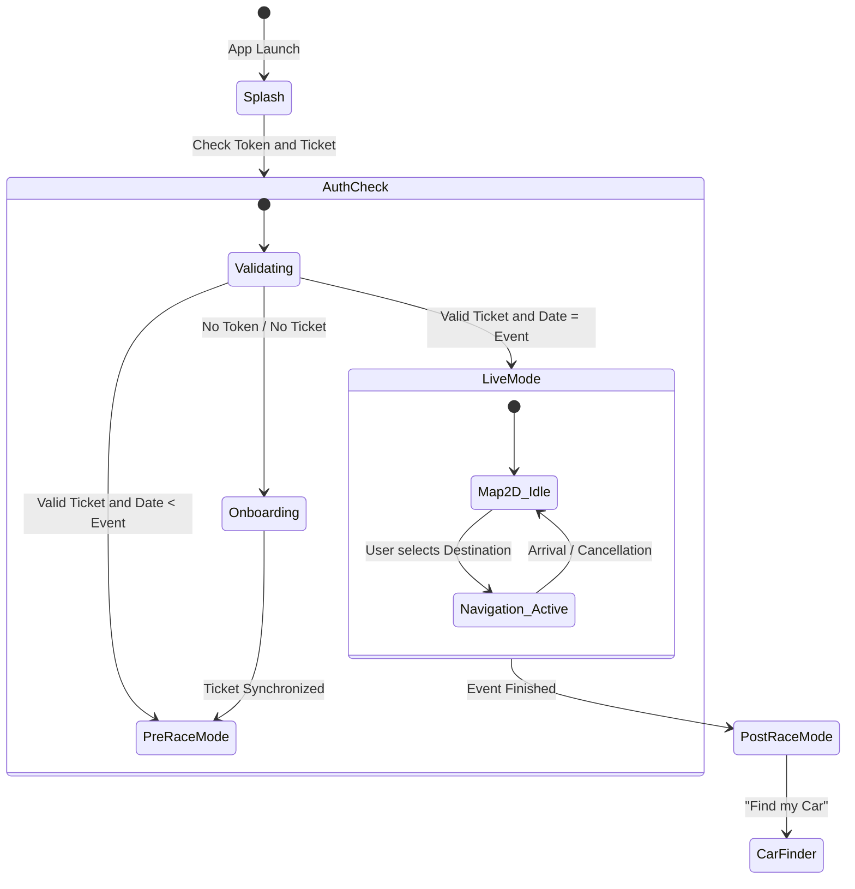
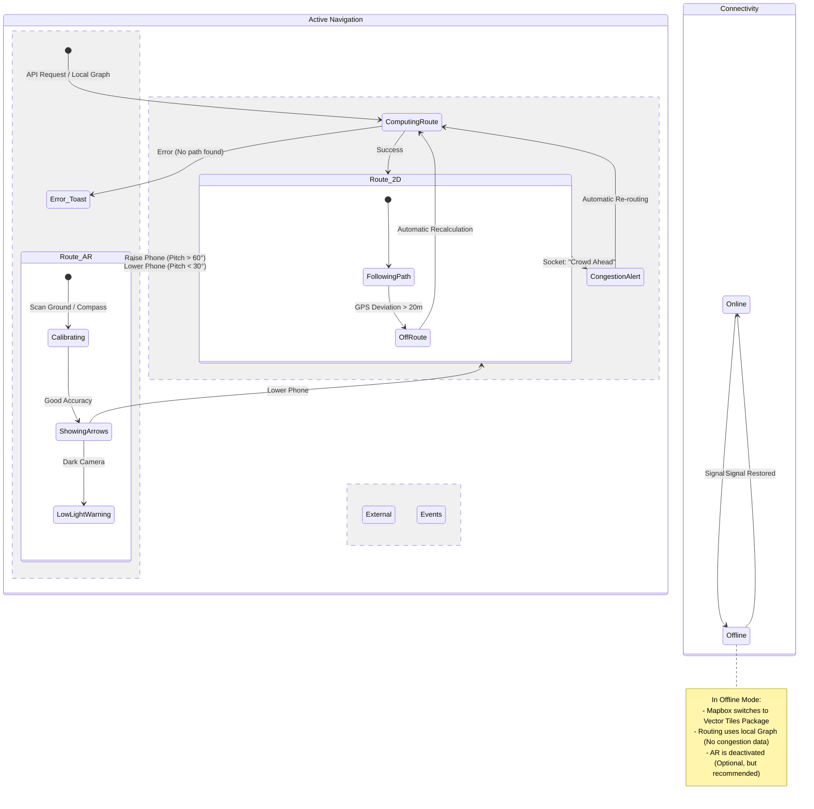

# App State Machine

## 1. High-Level Flow (Global States)

This diagram defines the application's macro life cycle.

## 2. Navigation Engine (Complex Logic)

This is where the magic (and complexity) happens. We define how the user enters and leaves AR mode and how we handle connection loss.

### AR/2D Transition Logic

- **Main Trigger:** Gyroscope (Phone tilt).
- If `pitch > 60°` (portrait/vertical) -> **Activate AR**.
- If `pitch < 30°` (landscape/flat) -> **Return to 2D**.

- **Secondary Trigger:** Manual "View in AR" button.

## 3. Description of Key States

### A. `PreRaceMode` (US3)

- **Objective:** Planning and anticipation.
- **Restrictions:** Does not consume battery searching for high-precision GPS.
- **UI:** Shows schedule (`events_schedule`), recommended access points, and offline map downloads.
- **Exit:** Automatically switches to `LiveMode` on the day of the race at 06:00 AM.

### B. `Navigation_Active` (US4, US7, US8)

It is the most critical state. Consumes a lot of battery and data.

- **Sub-state `ComputingRoute`:**
  1. Consults the server (API) for congestion.
  2. If the server fails/takes > 3s, calculates the local route (Plan B).

- **Sub-state `Route_AR`:**
  - **Calibration:** When raising the phone, ViroReact needs 1-2 seconds to anchor the terrain. A "Detecting terrain..." loader should be shown.
  - **Safety Lock:** If the user walks too fast (>10km/h), AR locks and shows "For your safety, look ahead".

### C. `Offline_Mode` (US33)

This is a "Superimposed State" (can occur at any time).

- **Behavior:**
  - Route API (`POST /navigation/route`) is blocked.
  - Local route engine (`Mapbox.DirectionsFactory`) is activated.
  - "Friends" markers are hidden (since they cannot be updated).
  - A yellow banner is shown: "Offline Mode - Basic routes active".

## 4. Edge Cases (To be programmed)

1. **"The Ghost User":**
  - _Situation:_ GPS says the user is 500 km from the circuit (start error).
  - _Action:_ The state diagram must avoid entering `Navigation_Active`. Shows a modal: "It seems you are not at the circuit".

2. **"The Congestion Loop":**
  - _Situation:_ The server says Route A is full. The app calculates Route B. 10 seconds later, Route B also fills up.
  - _Action:_ Define a `debounce` in the `ReRouting` state. Do not re-calculate more than once per minute to avoid confusing the user.

3. **"Critical Battery":**
  - _Situation:_ Battery < 15%.
  - _Action:_ Forces transition from `Route_AR` to `Route_2D` and deactivates the gyroscope sensor to save energy.
