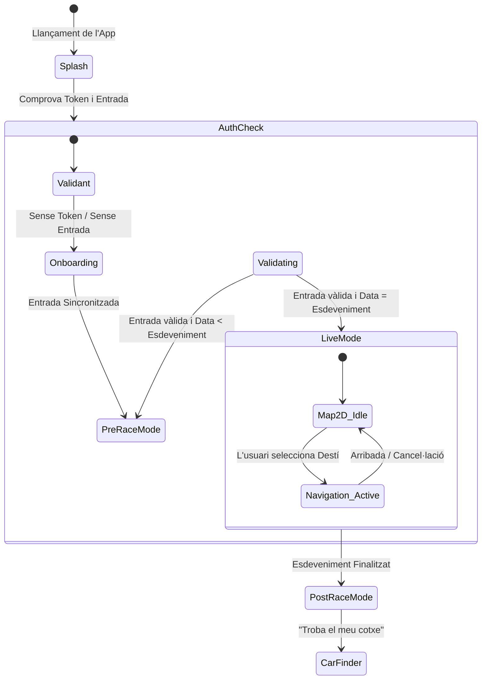
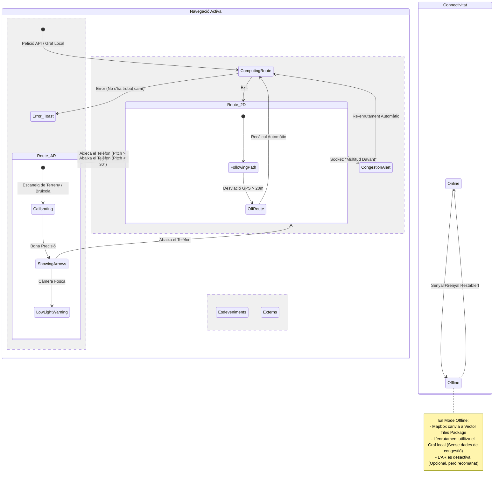

# Màquina d'Estats de l'App

## 1. Flux d'Alt Nivell (Estats Globals)

Aquest diagrama defineix el macro cicle de vida de l'aplicació.

## 2. Motor de Navegació (Lògica Complexa)

Aquí és on passa la màgia (i la complexitat). Definim com l'usuari entra i surt del mode AR i com gestionem la pèrdua de connexió.

### Lògica de Transició AR/2D

- **Disparador Principal:** Giroscopi (Inclinació del telèfon).
- Si `pitch > 60°` (retrat/vertical) -> **Activa AR**.
- Si `pitch < 30°` (apaïsat/pla) -> **Torna a 2D**.

- **Disparador Secundari:** Botó manual "Veure en AR".

## 3. Descripció dels Estats Clau

### A. `PreRaceMode` (US3)

- **Objectiu:** Planificació i anticipació.
- **Restriccions:** No consumeix bateria cercant GPS d'alta precisió.
- **UI:** Mostra l'horari (`events_schedule`), punts d'accés recomanats i descàrregues de mapes offline.
- **Sortida:** Canvia automàticament a `LiveMode` el dia de la cursa a les 06:00 AM.

### B. `Navigation_Active` (US4, US7, US8)

És l'estat més crític. Consumeix molta bateria i dades.

- **Sub-estat `ComputingRoute`:**
  1. Consulta el servidor (API) per congestió.
  2. Si el servidor falla o triga > 3s, calcula la ruta local (Pla B).

- **Sub-estat `Route_AR`:**
  - **Calibratge:** En aixecar el telèfon, ViroReact necessita 1-2 segons per anclar el terreny. S'ha de mostrar un carregador de "Detectant terreny...".
  - **Bloqueig de Seguretat:** Si l'usuari camina massa ràpid (>10km/h), l'AR es bloqueja i mostra "Per la teva seguretat, mira endavant".

### C. `Offline_Mode` (US33)

Aquest és un "Estat Superposat" (pot ocórrer en qualsevol moment).

- **Comportament:**
  - L'API de ruta (`POST /navigation/route`) està bloquejada.
  - S'activa el motor de ruta local (`Mapbox.DirectionsFactory`).
  - Els marcadors d'"Amics" s'amaguen (ja que no es poden actualitzar).
  - Es mostra un bàner groc: "Mode Offline - Rutes bàsiques actives".

## 4. Casos Extrems (Per programar)

1. **"L'Usuari Fantasma":**
  - _Situació:_ El GPS diu que l'usuari està a 500 km del circuit (error d'inici).
  - _Acció:_ El diagrama d'estats ha d'evitar entrar a `Navigation_Active`. Mostra un modal: "Sembla que no ets al circuit".

2. **"El Bucle de Congestió":**
  - _Situació:_ El servidor diu que la Ruta A està plena. L'app calcula la Ruta B. 10 segons després, la Ruta B també s'omple.
  - _Acció:_ Definir un `debounce` a l'estat de `ReRouting`. No recalleu més d'una vegada per minut per evitar confondre l'usuari.

3. **"Bateria Crítica":**
  - _Situació:_ Bateria < 15%.
  - _Acció:_ Forçar la transició de `Route_AR` a `Route_2D` i desactivar el sensor del giroscopi per estalviar energia.
