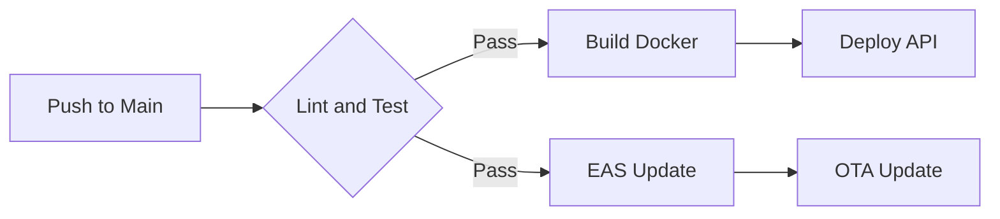

# 🚀 Deployment Guide: Circuit Copilot

This document describes the production deployment process for both the API and the mobile application.

> [!IMPORTANT]
> Before deploying, make sure all tests pass by running `npm run test` at the root.

## ☁️ 1. Desplegament de l'API (Node.js + PostGIS)

The backend should be deployed in a provider that supports **Docker Containers** and **Persistent Volumes**.

### Infrastructure Requirements
1. **Database:** PostgreSQL 15+ with the **PostGIS** extension.
2. **SSL/TLS:** Mandatory for HTTPS/WSS.
3. **WebSockets:** The load balancer must allow persistent connections.

### 🔑 Environment Variables (Production)

| Variable | Description |
| :--- | :--- |
| `DATABASE_URL` | Production connection string. |
| `JWT_SECRET` | Secret key for authentication. |
| `NODE_ENV` | Must be `production`. |

## 📱 2. Desplegament de l'Aplicació Mòbil

Utilitzem **EAS (Expo Application Services)** per gestionar les construccions.

> [!TIP]
> Use **Over-the-Air (OTA)** updates to fix minor bugs without having to go through the Store review.

### Build Profiles (`eas.json`)
Make sure you have the production profile configured with the correct API URLs:

```bash
# For Android (.aab)
eas build --platform android --profile production

# For iOS (.ipa)
eas build --platform ios --profile production
```

## 🧪 3. Verificació Post-Desplegament

> [!CAUTION]
> Always check the API logs after a deployment to ensure that migrations have been applied correctly.

1. **Health Check:** Verify that `https://api.yourdomain.com/health` responds correctly.
2. **WebSocket Handshake:** Confirm that the app connects correctly to the production socket.
3. **Mapbox:** Verify that the production token is active and maps are loading.

## 🔄 Pipeline de CI/CD


