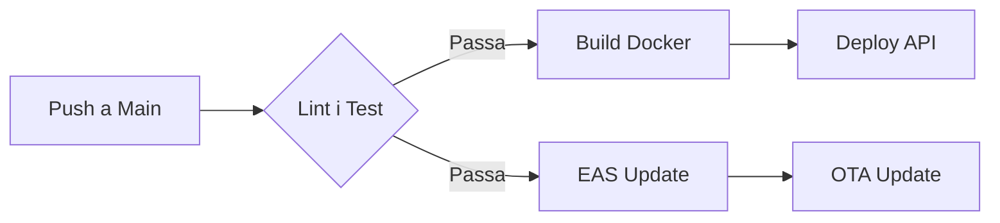

# 🚀 Guia de Desplegament: Circuit Copilot

Aquest document descriu el procés de desplegament a producció tant de l'API com de l'aplicació mòbil.

> [!IMPORTANT]
> Abans de desplegar, assegura't que tots els tests passen executant `npm run test` a l'arrel.

## ☁️ 1. Desplegament de l'API (Node.js + PostGIS)

El backend s'ha de desplegar en un proveïdor que suporti **Contenidors Docker** i **Volums Persistents**.

### Requisits d'Infraestructura
1. **Base de dades:** PostgreSQL 15+ amb l'extensió **PostGIS**.
2. **SSL/TLS:** Obligatori per a HTTPS/WSS.
3. **WebSockets:** El balancejador de càrrega ha de permetre connexions persistents.

### 🔑 Variables d'Entorn (Producció)

| Variable | Descripció |
| :--- | :--- |
| `DATABASE_URL` | Cadena de connexió de producció. |
| `JWT_SECRET` | Clau secreta per a l'autenticació. |
| `NODE_ENV` | Ha de ser `production`. |

## 📱 2. Desplegament de l'Aplicació Mòbil

Utilitzem **EAS (Expo Application Services)** per gestionar les construccions (builds).

> [!TIP]
> Utilitza les actualitzacions **Over-the-Air (OTA)** per corregir errors menors sense haver de passar per la revisió de la Store.

### Perfils de Construcció (`eas.json`)
Assegura't de tenir el perfil de producció configurat amb les URLs de l'API correctes:

```bash
# Per a Android (.aab)
eas build --platform android --profile production

# Per a iOS (.ipa)
eas build --platform ios --profile production
```

## 🧪 3. Verificació Post-Desplegament

> [!CAUTION]
> Revisa sempre els logs de l'API després d'un desplegament per assegurar-te que les migracions s'han aplicat correctament.

1. **Health Check:** Verifica que `https://api.elvostredomini.com/health` respon correctament.
2. **WebSocket Handshake:** Confirma que l'app es connecta correctament al socket de producció.
3. **Mapbox:** Verifica que el token de producció està actiu i els mapes carreguen.

## 🔄 Pipeline de CI/CD


