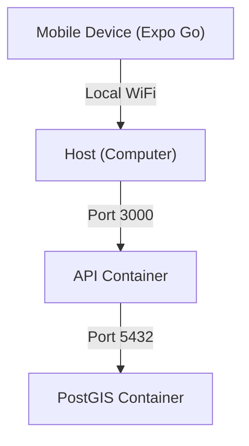

# 🛠️ Circuit Copilot: Developer Setup Guide

This guide describes the local development environment setup for the **Circuit Copilot** monorepo.

> [!IMPORTANT]
> This project is designed to work optimally on **Linux** or **macOS**. For Windows, the use of **WSL2** is recommended.

## 📋 Prerequisites

Before cloning the repository, make sure you have the following installed:

1. **Node.js (LTS)**: v18.0.0 or higher.
2. **Docker Desktop**: Running and updated (necessary for PostGIS and Redis).
3. **Mobile Development Environment**:
   - **iOS**: Xcode (Mac only).
   - **Android**: Android Studio + SDK Platform Tools.
4. **Mapbox Account**: You need a public access token for the maps.

## 🏗️ Repository Structure

We use **Turborepo**. There is no need to run `npm install` in each individual folder.

```text
/
├── apps/
│   ├── mobile/         # Expo Application (React Native)
│   └── api/            # Node.js + Express API
├── packages/
│   ├── shared/         # Shared TypeScript types (@app/shared)
│   └── db/             # Drizzle Schema and Migrations (@app/db)
└── docker-compose.yml  # Orchestrates the PostGIS database
```

---

## 🚀 Step 1: Installation

1. **Clone the repository:**
   ```bash
   git clone https://github.com/your-org/circuit-copilot.git
   cd circuit-copilot
   ```

2. **Install dependencies:**
   > [!NOTE]
   > Always run this command from the root to load all monorepo dependencies.
   ```bash
   npm install
   ```

## 🗄️ Step 2: Database and Infrastructure

We use Docker Compose to run PostgreSQL with the PostGIS extension.

1. **Start the environment:**
   ```bash
   docker compose up -d
   ```

2. **Prepare the database:**
   ```bash
   npm run migrate
   ```

## 💻 Step 3: Workflow

> [!TIP]
> For active development, the fastest way is to use the unified command:
> ```bash
> npm run dev
> ```
> This will start the API and the Expo Metro Bundler at the same time.

### Main Root Commands

- `npm run dev`: Full development mode.
- `npm run build`: Compiles all applications verifying types.
- `npm run lint`: Runs eslint across the entire monorepo.
- `npm run test`: Runs unified tests.

### 🛠️ Database Management (Drizzle)

- `npm run generate`: Records schema changes.
- `npm run migrate`: Pushes changes to the infrastructure DB (PostGIS).
- `npm run seed`: Fills the database with initial test data.
- `npm run studio`: Interactive web viewer to explore data.

## ❓ Troubleshooting

> [!WARNING]
> **Mapbox Token**: If the map appears blank, check that your token has the appropriate permissions.

- **PostGIS not detected**: If the API fails on geospatial queries, ensure the Docker container is active and you have run `npm run migrate`.
- **Port 8081 Errors**: Expo uses port 8081. Close other Metro instances or processes that might be using it.

## 🌐 Network Topology


