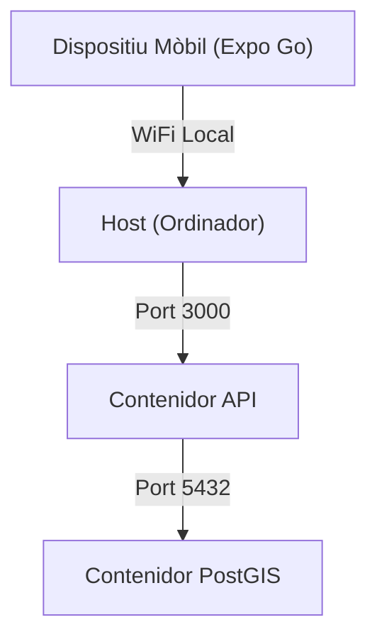

# 🛠️ Circuit Copilot: Guia de Configuració para Desarrolladores

Aquesta guia descriu la configuració de l'entorn de desenvolupament local per al monorepo de **Circuit Copilot**.

> [!IMPORTANT]
> Aquest projecte està dissenyat per funcionar de manera òptima en sistemes **Linux** o **macOS**. Per a Windows, es recomana l'ús de **WSL2**.

## 📋 Prerequisits

Abans de clonar el repositori, assegura't de tenir instal·lat el següent:

1. **Node.js (LTS)**: v18.0.0 o superior.
2. **Docker Desktop**: En funcionament i actualitzat (necessari per a PostGIS i Redis).
3. **Entorn de Desenvolupament Mòbil**:
   - **iOS**: Xcode (només per a Mac).
   - **Android**: Android Studio + SDK Platform Tools.
4. **Compte de Mapbox**: Necessites un token d'accés públic per als mapes.

## 🏗️ Estructura del Repositori

Utilitzem **Turborepo**. No cal fer `npm install` a cada carpeta individual.

```text
/
├── apps/
│   ├── mobile/         # Aplicació Expo (React Native)
│   └── api/            # API Node.js + Express
├── packages/
│   ├── shared/         # Tipus TypeScript compartits (@app/shared)
│   └── db/             # Esquema de Drizzle i Migracions (@app/db)
└── docker-compose.yml  # Orquestra la base de dades PostGIS
```

---

## 🚀 Pas 1: Instal·lació

1. **Clona el repositori:**
   ```bash
   git clone https://github.com/la-teva-org/circuit-copilot.git
   cd circuit-copilot
   ```

2. **Instal·la les dependències:**
   > [!NOTE]
   > Executa sempre aquesta ordre des de l'arrel per carregar totes les dependències del monorepo.
   ```bash
   npm install
   ```

## 🗄️ Pas 2: Base de dades i Infraestructura

Utilitzem Docker Compose per executar PostgreSQL amb l'extensió PostGIS.

1. **Inicia l'entorn:**
   ```bash
   docker compose up -d
   ```

2. **Prepara la base de dades:**
   ```bash
   npm run migrate
   ```

## 💻 Pas 3: Flux de Treball

> [!TIP]
> Per al desenvolupament actiu, la forma més ràpida és utilitzar la comanda unificada:
> ```bash
> npm run dev
> ```
> Això aixecarà l'API i el Metro Bundler de Expo alhora.

### Comandes Principals de l'Arrel

- `npm run dev`: Mode desenvolupament total.
- `npm run build`: Compila totes les aplicacions verificant tipus.
- `npm run lint`: Executa l'eslint a tot el monorepo.
- `npm run test`: Executa les proves unificades.

### 🛠️ Gestió de BD (Drizzle)

- `npm run generate`: Registra canvis en l'esquema.
- `npm run migrate`: Empeny els canvis a la BD d'infraestructura.
- `npm run studio`: Visor web de dades local.

## ❓ Solució de Problemes

> [!WARNING]
> **Token de Mapbox**: Si el mapa apareix en blanc, revisa que el teu token tingui els permisos adequats.

- **PostGIS no detectat**: Si l'API falla en consultes geoespacials, assegura't que el contenidor de Docker està actiu i has executat `npm run migrate`.
- **Eerrors de Port 8081**: Expo utilitza el port 8081. Tanca altres instàncies de Metro o procesos que puguin estar utilitzant-lo.

## 🌐 Topologia de Xarxa


