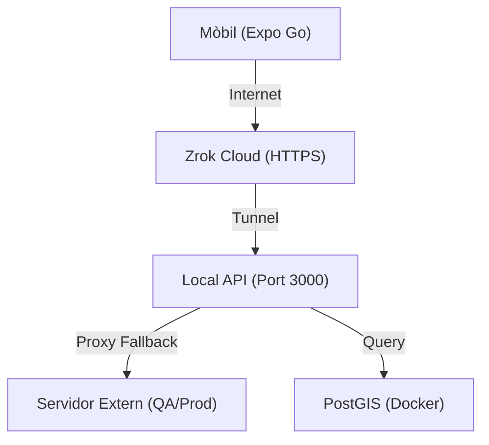

# 🛠️ Circuit Copilot: Developer Setup Guide

This guide describes the local development environment setup for the **Circuit Copilot** monorepo.

> [!IMPORTANT]
> This project is designed to work optimally on **Linux** or **macOS**. For Windows, the use of **WSL2** is recommended.

## 📋 Prerequisites

Before cloning the repository, make sure you have the following installed:

1. **Node.js (LTS)**: v18.0.0 or higher.
2. **Docker Desktop**: Running and updated (necessary for PostGIS and Redis).
3. **Mobile Development Environment**:
   - **iOS**: Xcode (Mac only).
   - **Android**: Android Studio + SDK Platform Tools.
4. **Mapbox Account**: You need a public access token for the maps.

## 🏗️ Repository Structure

We use **Turborepo**. There is no need to run `npm install` in each individual folder.

```text
/
├── apps/
│   ├── mobile/         # Expo Application (React Native)
│   └── api/            # Node.js + Express API
├── packages/
│   ├── shared/         # Shared TypeScript types (@app/shared)
│   └── db/             # Drizzle Schema and Migrations (@app/db)
└── docker-compose.yml  # Orchestrates the PostGIS database
```

## 🚀 Guia Ràpida

Segueix aquests 5 passos per posar-ho tot en marxa ràpidament:

### 1. Instal·lació de dependències 📦
Executa aquesta comanda a l'arrel del projecte:
```bash
npm install
```

### 2. Configuració de l'entorn (.env) 🤫
Vés a la carpeta `apps/api`:
1. Còpia l'arxiu `.env.example` i anomena'l `.env.development`.
2. Edita l'arxiu i posa la URL del servidor extern a `EXTERNAL_API_URL`.

### 3. Arrancar el motor 🏎️
Des de l'arrel del projecte, encén l'API:
```bash
npm run dev --workspace=@app/api
```

### 4. Túnel per a Mobile (Zrok) 🪄
Si vols provar-ho en un mòbil real, obre una altra terminal i executa:
```bash
zrok share public http://localhost:3000
```
Còpia la URL que et doni (ex: `https://xxxx.zrok.io`) i posa-la a la configuració de la App d'Expo.

### 5. Verificació ✅
Obre el navegador a: `http://localhost:3000/status`. Si veus `"status": "ok"`, ja funciona correctament

## 🏗️ Estructura del Repositori
Utilitzem **Turborepo** per gestionar el monorepo d'una sola vegada.

- `/apps/mobile`: Aplicació Expo (React Native).
- `/apps/api`: Backend en Node.js + Express.
- `/packages/shared`: Tipus i lògica compartida.
- `/packages/db`: Esquema de dades i migracions.

## 🗄️ Infraestructura (Docker)
L'API necessita una base de dades PostGIS. Pots aixecar-la amb:
```bash
docker compose up -d
npm run migrate # Aplica els canvis a la base de dades
```

## 🌐 Topologia de Xarxa (Amb Túnel)


> [!TIP]
> Per a una explicació més detallada de l'estratègia de desenvolupament, consulta **[.context/02-api/dev-strategy.md](file:///home/kore/Documents/Code/Projects/app_25_26_tr3g3_cdc/.context/02-api/dev-strategy.md)**.
