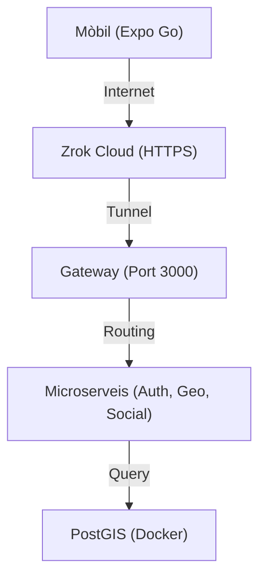

# 🛠️ Circuit Copilot: Guia de Configuració per a Desenvolupadors

Aquesta guia descriu la configuració de l'entorn de desenvolupament local per al monorepo de **Circuit Copilot**.

> [!IMPORTANT]
> Aquest projecte està dissenyat per funcionar de manera òptima en **Linux** o **macOS**. Per a Windows, es recomana l'ús de **WSL2**.

## 📋 Prerequisits

Abans de clonar el repositori, assegura't de tenir instal·lat el següent:

1. **Node.js (LTS)**: v18.0.0 o superior.
2. **Docker Desktop**: En funcionament i actualitzat (necessari per a PostGIS i Redis).
3. **Entorn de Desenvolupament Mòbil**:
   - **iOS**: Xcode (només Mac).
   - **Android**: Android Studio + SDK Platform Tools.
4. **Compte de Mapbox**: Necessites un token d'accés públic per als mapes.

## 🏗️ Estructura del Repositori

Utilitzem **Turborepo**. No cal executar `npm install` a cada carpeta individual.

```text
/
├── apps/
│   ├── mobile/         # Aplicació Expo (React Native)
│   └── api/            # Directori de microserveis
│       ├── gateway/    # API Gateway (Punt d'entrada)
│       ├── auth/       # Servei d'Antenticació
│       ├── geo/        # Servei de Mapes i Geo
│       └── social/     # Servei de Grups i Ubicació en viu
├── packages/
│   ├── types-schema/   # Tipus i esquemes compartits (@app/types-schema)
│   ├── core/           # Middleware i utilitats de backend (@app/core)
│   └── db/             # Esquema de Drizzle i Migracions (@app/db)
├── docs/               # Documentació tècnica i d'arquitectura
└── docker-compose.yml  # Orquestra tota la infraestructura amb Docker
```

## 🚀 Guia Ràpida

Segueix aquests 5 passos per posar-ho tot en marxa ràpidament:

### 1. Instal·lació de dependències 📦
Executa aquesta comanda a l'arrel del projecte:
```bash
npm install
```

### 2. Configuració de l'entorn (.env) 🤫
Cada servei té el seu propi arxiu de configuració. Vés a `apps/server/gateway`, `apps/server/auth-service`, etc.:
1. Còpia l'arxiu `.env.example` i anomena'l `.env.development`.
2. Edita l'arxiu amb les credencials corresponents.

### 3. Arrancar el sistema 🏎️
Des de l'arrel del projecte, pots arrancar tots els serveis:
```bash
npm run dev
```
O via Docker (recomanat per a base de dades):
```bash
docker compose up --build
```

### 4. Túnel per a Mobile (Zrok) 🪄
Si vols provar-ho en un mòbil real, obre una altra terminal i executa:
```bash
zrok share public http://localhost:3000
```
Còpia la URL que et doni (ex: `https://xxxx.zrok.io`) i posa-la a la configuració de la App d'Expo.

### 5. Verificació ✅
Obre el navegador a: `http://localhost:3000/status` (Gateway). Si veus `"status": "gateway_ok"`, ja funciona correctament.

## 🗄️ Infraestructura (Docker)
El sistema necessita una base de dades PostGIS. Pots aixecar-la i aplicar migracions amb:
```bash
docker compose up db -d
npm run migrate # Aplica els canvis a la base de dades
```

## 🌐 Topologia de Xarxa (Amb Túnel)


## 💡 Troubleshooting (Resolució de Problemes)

### Error: EACCES: permission denied, open '/app/package.json'
Si estàs utilitzant **Linux amb SELinux actiu** (ex: Fedora, RHEL, CentOS) i veus aquest error en executar Docker:
1. Assegura't que els volums a `docker-compose.yml` tenen el flag `:z` (ex: `- .:/app:z`).
2. Si el problema persisteix, potser cal etiquetar manualment el directori: `chcon -Rt svirt_sandbox_file_t .` (utilitza amb precaució).
3. Alternativament, comprova si el teu usuari té els permisos correctes al directori amfitrió.

> [!TIP]
> Per a una explicació més detallada de l'estratègia de desenvolupament, consulta **[docs/api/dev-strategy.md](file:///home/nildi/app_25_26_tr3g3_cdc/docs/api/dev-strategy.md)**.
