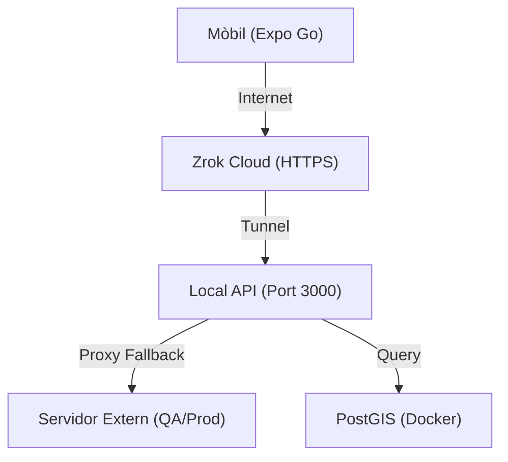

# 🛠️ Circuit Copilot: Guia de Configuració para Desarrolladores

Aquesta guia descriu la configuració de l'entorn de desenvolupament local per al monorepo de **Circuit Copilot**.

> [!IMPORTANT]
> Aquest projecte està dissenyat per funcionar de manera òptima en sistemes **Linux** o **macOS**. Per a Windows, es recomana l'ús de **WSL2**.

## 📋 Prerequisits

Abans de clonar el repositori, assegura't de tenir instal·lat el següent:

1. **Node.js (LTS)**: v18.0.0 o superior.
2. **Docker Desktop**: En funcionament i actualitzat (necessari per a PostGIS i Redis).
3. **Entorn de Desenvolupament Mòbil**:
   - **iOS**: Xcode (només per a Mac).
   - **Android**: Android Studio + SDK Platform Tools.
4. **Compte de Mapbox**: Necessites un token d'accés públic per als mapes.

## 🏗️ Estructura del Repositori

Utilitzem **Turborepo**. No cal fer `npm install` a cada carpeta individual.

```text
/
├── apps/
│   ├── mobile/         # Aplicació Expo (React Native)
│   └── api/            # API Node.js + Express
├── packages/
│   ├── shared/         # Tipus TypeScript compartits (@app/shared)
│   └── db/             # Esquema de Drizzle i Migracions (@app/db)
└── docker-compose.yml  # Orquestra la base de dades PostGIS
```

## 🚀 Guia Ràpida

Segueix aquests 5 passos per posar-ho tot en marxa ràpidament:

### 1. Instal·lació de dependències 📦
Executa aquesta comanda a l'arrel del projecte:
```bash
npm install
```

### 2. Configuració de l'entorn (.env) 🤫
Vés a la carpeta `apps/api`:
1. Còpia l'arxiu `.env.example` i anomena'l `.env.development`.
2. Edita l'arxiu i posa la URL del servidor extern a `EXTERNAL_API_URL`.

### 3. Arrancar el motor 🏎️
Des de l'arrel del projecte, encén l'API:
```bash
npm run dev --workspace=@app/api
```

### 4. Túnel per a Mobile (Zrok) 🪄
Si vols provar-ho en un mòbil real, obre una altra terminal i executa:
```bash
zrok share public http://localhost:3000
```
Còpia la URL que et doni (ex: `https://xxxx.zrok.io`) i posa-la a la configuració de la App d'Expo.

### 5. Verificació ✅
Obre el navegador a: `http://localhost:3000/status`. Si veus `"status": "ok"`, ja funciona correctament

## 🏗️ Estructura del Repositori
Utilitzem **Turborepo** per gestionar el monorepo d'una sola vegada.

- `/apps/mobile`: Aplicació Expo (React Native).
- `/apps/api`: Backend en Node.js + Express.
- `/packages/shared`: Tipus i lògica compartida.
- `/packages/db`: Esquema de dades i migracions.

## 🗄️ Infraestructura (Docker)
L'API necessita una base de dades PostGIS. Pots aixecar-la amb:
```bash
docker compose up -d
npm run migrate # Aplica els canvis a la base de dades
```

## 🌐 Topologia de Xarxa (Amb Túnel)


> [!TIP]
> Per a una explicació més detallada de l'estratègia de desenvolupament, consulta **[.context/02-api/dev-strategy.md](file:///home/kore/Documents/Code/Projects/app_25_26_tr3g3_cdc/.context/02-api/dev-strategy.md)**.
