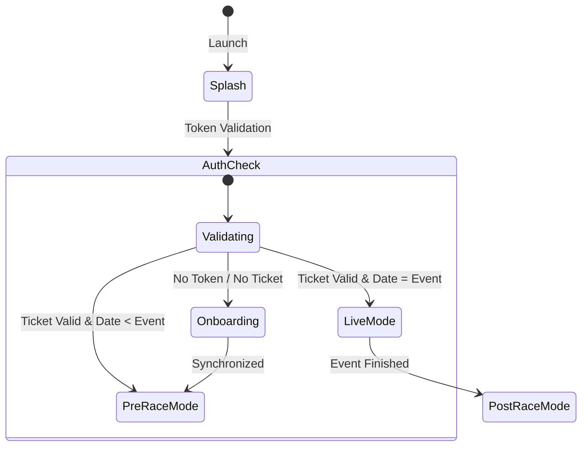

# Frontend Architecture: Mobile App

The Circuit Copilot mobile application is built with Expo and React Native, focusing on high-performance map interactions and location-based AR.

## Core Philosophical Pillars

1. **Mixed Style Design:** Fusion of Cupertino elegance and Material structure.
2. **Offline-First:** Critical data (POIs, Map Styles) is cached to survive network saturation.
3. **Location Intelligence:** Efficiency-gated GPS updates and on-device routing calculations.

## State Management

We use a hybrid strategy to optimize for different types of data:

- **Server State:** [React Query](https://tanstack.com/query/latest) for API requests.
- **Global UI State:** [Zustand](https://github.com/pmndrs/zustand) for shared ephemeral data.
- **Storage:** [MMKV](https://github.com/mrousavy/react-native-mmkv) for high-speed synchronous persistence.

## Offline Strategy

Given the typical network saturation at circuits, the app is designed to be functional "Off the Grid":

1. **Data Caching:** React Query persists critical responses to MMKV. Static POIs are stored in a local SQLite database if necessary.
2. **Offline Maps:** MapLibre is configured to use pre-downloaded offline tiles for the circuit region.
3. **Local Routing:** Navigation graphs are stored locally. The server only provides real-time congestion weights as an enhancement.
4. **Deferred Telemetry:** GPS updates are queued locally if the server is unreachable.

## Map & Performance

- **Engine:** MapLibre GL.
- **Optimization:** We force `surfaceView={true}` on Android to bypass the overhead of `TextureView` during complex UI layering.
- **Marker Layering:** Bulk markers use GPU-accelerated `CircleLayer` and `SymbolLayer`, while only the selected marker uses a high-detail native `MarkerView`.

## Augmented Reality (AR)

- **Engine:** ViroReact.
- **Logic:** Location-based AR using device compass and GPS. 
- **Transition:** Handled by pitch detection (Tilt-to-AR) or manual toggle.

## App States & Transitions

We use a high-level state machine to manage the application lifecycle:

### AR/2D Transition Logic
The transition between 2D and AR is primarily driven by device pitch:
- **Pitch > 60°** (Vertical): Activate AR.
- **Pitch < 30°** (Horizontal): Revert to 2D Map.
- **Automatic Override:** AR is disabled if `battery < 15%` or if severe magnetic interference is detected.

---
> For setup instructions, see the [**Developer Setup Guide**](../guides/setup.md).
