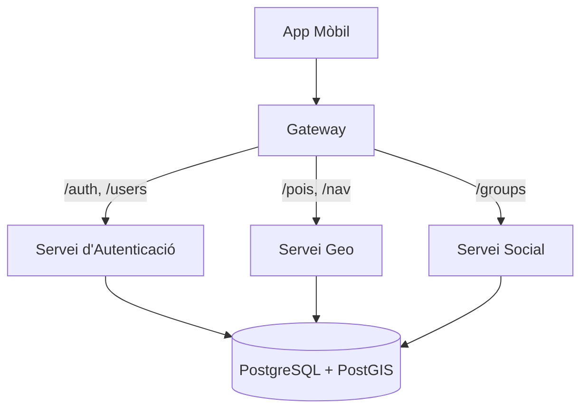

# Arquitectura de Microserveis de Circuit Copilot

Aquest document descriu l'arquitectura de microserveis per al sistema backend de Circuit Copilot.

## Resum

El backend està dividit en múltiples serveis independents per garantir l'aïllament de fallades i l'escalabilitat. Un servei Gateway actua com a punt d'entrada únic per als clients (App Mòbil), encaminant les peticions al microservei corresponent.

### Diagrama d'Arquitectura



## Serveis

### 1. Gateway (`apps/server/gateway`)

És el punt d'entrada únic per a l'aplicació mòbil. No conté lògica de negoci, la seva funció és **redirigir el trànsit**:

- **Encaminament:** Rep totes les peticions i les envia al microservei corresponent.
- **Seguretat i Control:** Gestiona la seguretat centralitzada i el límit de peticions (Rate Limiting).
- **Abstracció:** Si un servei intern canvia d'adreça, el mòbil no necessita saber-ho, només parla amb el Gateway.

### 2. Servei d'Autenticació (`apps/server/auth-service`)

S'encarrega de tot el relacionat amb qui és l'usuari i el seu accés:

- **Sincronització d'entrades:** Enllaça el codi QR del tiquet amb un usuari.
- **Gestió de perfils:** Guarda les preferències (si l'usuari va en cadira de rodes, si prefereix evitar escales, etc.).
- **Seguretat:** Emissió i validació de tokens JWT.

### 3. Servei Geo (`apps/server/geo-service`)

És el cervell geogràfic de l'aplicació, utilitzant la base de dades PostGIS:

- **Punts d'Interès (POIs):** Retorna la llista de banys, restaurants, graderies i parkings.
- **Navegació:** Calcula la ruta òptima des de la teva posició fins al teu seient o un servei, tenint en compte l'accessibilitat.
- **Ubicacions guardades:** On has deixat el cotxe o punts de trobada personals.

### 4. Servei Social (`apps/social-service`)

S'encarrega de la interacció entre persones durant l'esdeveniment:

- **Gestió de Grups:** Crear grups d'amics i unir-se mitjançant un codi d'invitació (ex. `FAST-CARS`).
- **Seguiment en viu:** Utilitza WebSockets (`Socket.io`) per compartir la teva posició amb els teus amics en temps real sobre el mapa sense saturar la resta de l'API.

## Desenvolupament

### Execució amb Docker Compose (Recomanat)

Per iniciar tota la infraestructura del backend:

```bash
docker-compose up --build
```

Això aixecarà:

- Base de dades Postgres (Port 5433)
- Gateway (Port 3000)
- Servei d'Autenticació (Port 3001)
- Servei Geo (Port 3002)
- Servei Social (Port 3003)

### Execució Local (Turbo)

També pots executar els serveis localment a la teva màquina utilitzant Turbo Repo:

```bash
npm run dev
```

Assegura't de tenir una instància local de PostgreSQL en funcionament o utilitza la de docker-compose (`docker-compose up db`).

## Resolució de problemes

- **Error de permisos (EACCES):** Si utilitzes Linux amb SELinux actiu, assegura't que els volums a `docker-compose.yml` tenen el sufix `:z` (ex: `.:/app:z`).
- **Servei no accessible:** Comprova si el contenidor està funcionant amb `docker ps`.
- **Error de connexió a la base de dades:** Assegura't que la `DATABASE_URL` és correcta a `.env.development`.
